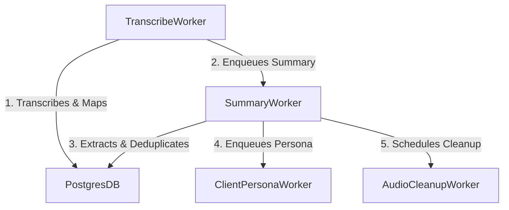

# Larity — System Architecture & Feature Reference

Welcome to the comprehensive feature and architecture reference for **Larity**. 

Larity is a real-time B2B meeting intelligence platform and organizational memory engine. It acts as an active, zero-overhead meeting assistant that listens to discussions, dynamically tracks commitments and policy guardrails, detects risks and tone anomalies in real time, and persists structured insights (decisions, tasks, open questions) into a unified company-wide memory index.

---

## 1. High-Level System Architecture

Larity is structured as a monorepo consisting of specialized apps and shared packages. It is designed for high-concurrency, low-latency real-time stream processing and cost-controlled background analytics.

```mermaid
graph TD
    %% Desktop Client
    subgraph Client ["Tauri Desktop App (apps/desktop)"]
        UI["React/Vite UI"]
        AS["AudioStreamingClient (JS)"]
        VADM["VadManager (JS)"]
        RVAD["Rust VAD (Silero)"]
        VADM -->|Tauri listen| RVAD
    end

    %% Ingestion
    subgraph Ingestion ["Realtime Server (apps/realtime)"]
        WS["Elysia WebSocket Server"]
        AS -->|Audio Frames & VAD| WS
    end

    %% Streaming Services
    subgraph STT ["Speech-to-Text (packages/stt)"]
        DCS["DualChannelSession"]
        DGC["DeepgramConnection"]
        WS -->|Ingest| DCS
        DCS -->|Mic Stream (Ch0)| DGC
        DCS -->|Sys Stream (Ch1)| DGC
    end

    %% Redis State
    subgraph PubSub ["Redis Pub/Sub & Caching"]
        RPS["Redis Channels"]
        DGC -->|STT Partials / Finals| RPS
        VADM -->|VAD signals| RPS
    end

    %% Pipeline Engine
    subgraph Pipeline ["Meeting Mode Engine (packages/meeting-mode)"]
        MM["Subscriber"]
        PE["MeetingPipelineEngine"]
        PF["Pre-Filter"]
        SC["SpeculativeCache"]
        T1["Tier 1: Regex Detector"]
        T2["Tier 2: Gemini Flash-Lite"]
        T3["Tier 3: pgvector Search"]
        T4["Tier 4: Deep Gemini Pro"]
        CM["CommitmentManager"]
        CR["ConstraintManager"]
        SST["SpeakerStateTracker"]
        
        RPS -->|STT & VAD| MM
        MM -->|Utterance| PE
        PE --> PF
        PE --> SC
        PE --> T1
        PE --> T2
        PE --> T3
        PE --> T4
        PE --> CM
        PE --> CR
        PE --> SST
    end

    %% Database & SQS
    subgraph Storage ["Infrastructure (packages/infra)"]
        DB["PostgreSQL (pgvector)"]
        S3["AWS S3 Bucket"]
        BQ["BullMQ (Redis)"]
    end

    %% Background Workers
    subgraph Workers ["Worker Pool (apps/workers)"]
        TW["TranscribeWorker"]
        SW["SummaryWorker"]
        CPW["ClientPersonaWorker"]
        PBW["PreMeetingBriefWorker"]
        ACW["AudioCleanupWorker"]
    end

    PE -->|Saves Live State| RPS
    DCS -->|Saves Raw PCM| S3
    WS -->|Meeting Ended| BQ
    BQ -->|Trigger| TW
    TW -->|Chain| SW
    SW -->|Chain| CPW
    SW -->|Delayed Cleanup| ACW
    TW -->|Persists Transcript| DB
    SW -->|Persists Summary/Insights| DB
    CPW -->|Persists Client Persona| DB
    PBW -->|Generates pre-meeting briefs| DB
```

---

## 2. Ingestion & Real-Time Audio Streaming

### 2.1 Tauri Audio Capture & Backpressure Control
- **Two-Channel Capture**: The desktop app captures loopback system audio (remote participants) and physical microphone audio (local host).
- **Tagged Frame Streamer**: Tagged chunks are transmitted over WebSockets (`0` for Host Mic, `1` for System Audio) using 16-bit PCM Linear Mono format.
- **Backpressure Gating**: The client-side streaming engine monitors congestion. If the socket's `bufferedAmount` exceeds thresholds (default `64 KB`) or the pending queue grows beyond limit (default `8` frames), oldest audio frames are dropped to prevent memory leaks and UI latency.
- **Relevant Files**:
  - [apps/desktop/src/services/audio-streaming.ts](file:///home/haze/repos/larity/apps/desktop/src/services/audio-streaming.ts)
  - [apps/desktop/src/services/vad.ts](file:///home/haze/repos/larity/apps/desktop/src/services/vad.ts)

### 2.2 Elysia WebSocket Ingest & Deepgram Integration
- **Elysia WebSocket Endpoint**: Hosted under `apps/realtime`. Manages user authorization, role verification (`host` vs `participant`), and assigns incoming connections to active Redis-managed sessions.
- **Dual-Channel Live STT**: Splices single binary connections into independent mono connections directed to Deepgram, ensuring high accuracy without cross-channel distortion.
- **Interim Concatenation**: Concatenates intermediate transcription chunks (`is_final: true`) and outputs them as a unified sentence upon receiving Deepgram's `speech_final: true` or `UtteranceEnd` events, avoiding sentence fragmentation.
- **Diarization Index Offsetting**: Shifts remote speaker IDs on the system channel by `1000` to prevent collision with the host's mic channel indices.
- **Relevant Files**:
  - [apps/realtime/src/server.ts](file:///home/haze/repos/larity/apps/realtime/src/server.ts)
  - [packages/stt/src/deepgram/connection.ts](file:///home/haze/repos/larity/packages/stt/src/deepgram/connection.ts)
  - [packages/stt/src/dual-channel-session.ts](file:///home/haze/repos/larity/packages/stt/src/dual-channel-session.ts)

---

## 3. Real-Time Multi-Tiered AI Analysis Pipeline

Every finalized utterance published by the STT engine triggers Larity's cascading four-tier evaluation system. The pipeline is designed to enforce business rule compliance, track organizational memories, and minimize LLM expenses.

```
Utterance
   │
   ├── Pre-Filter (word length, duplicate/filler deletion)
   │
   ├── Speculative Cache Lookup (fuzzy Levenshtein lookup on in-flight partials)
   │
   ├── Tier 1: Structural Detection (regex blocklists, API keys, passwords, client names)
   │
   ├── Tier 2: Small LLM Classifier (intent, tone, topics, commitments, semantic cache)
   │
   ├── Tier 3: Embedding Search (pgvector query against commitments ledger)
   │
   └── Tier 4: Deep Reasoning (conditional Gemini Pro evaluation, cost-gated)
```

### 3.1 Pre-Filter
- Eliminates small greetings (e.g. "hi", "ok"), short utterances (sub-3 words), and duplicate sentences from executing downstream pipeline logic, saving database and LLM resources.
- **Relevant Files**:
  - [packages/meeting-mode/src/pipeline/pre-filter.ts](file:///home/haze/repos/larity/packages/meeting-mode/src/pipeline/pre-filter.ts)

### 3.2 Speculative Processing
- **Pre-Computing the Future**: Analyzes partial (in-flight) utterances with a confidence rating above `0.70` before the speaker finishes their sentence.
- **Speculative Cache**: Stores pre-computed classifications. When a final utterance lands, its text is compared to cached partials using **normalized Levenshtein distance**. If the mismatch ratio is under `0.30` (30%), the cached result is used, saving 200–300ms of critical path latency.
- **Structural Bypass**: Regex matches on high-risk keywords (e.g. "password", "NDA") bypass the LLM and instantly cache a synthetic "concern" classification.
- **Predictive Constraint Preloading**: Scans partial texts for topic domains (timeline, pricing, scope, legal, security, resources) and pre-fetches associated policy rules and calendar items into an LRU cache.
- **Relevant Files**:
  - [packages/meeting-mode/src/speculative/processor.ts](file:///home/haze/repos/larity/packages/meeting-mode/src/speculative/processor.ts)
  - [packages/meeting-mode/src/speculative/cache.ts](file:///home/haze/repos/larity/packages/meeting-mode/src/speculative/cache.ts)
  - [packages/meeting-mode/src/speculative/predictive-preloader.ts](file:///home/haze/repos/larity/packages/meeting-mode/src/speculative/predictive-preloader.ts)

### 3.3 Tier 1: Structural Detection
- Lightweight, zero-network checks for passwords, API keys, client names, and blocklisted words.
- **Relevant Files**:
  - [packages/meeting-mode/src/pipeline/tier1.ts](file:///home/haze/repos/larity/packages/meeting-mode/src/pipeline/tier1.ts)

### 3.4 Tier 2: Small LLM Classifier
- Runs a fast model (e.g., Gemini Flash-Lite / SambaNova) to categorize:
  - **Intent**: Question, agreement, concern, statement, commitment.
  - **Tone**: Aggressive, defensive, hesitant, standard.
  - **Topic Shift**: Updates topic states on the meeting fly.
  - **Commitment Details**: Extracted deadlines, quantities, or pricing figures.
- **Tier 2 Semantic Cache**: An embedding-based semantic cache that checks for identical or highly similar statements, skipping duplicate LLM calls.
- **Filler Gate**: If Tier 2 detects simple greetings or low-value chatter with high confidence, it sets `shouldStopForDeepReasoning = true` to prevent expensive Tier 4 logic.
- **Relevant Files**:
  - [packages/meeting-mode/src/pipeline/tier2.ts](file:///home/haze/repos/larity/packages/meeting-mode/src/pipeline/tier2.ts)
  - [packages/meeting-mode/src/pipeline/tier2-cache.ts](file:///home/haze/repos/larity/packages/meeting-mode/src/pipeline/tier2-cache.ts)

### 3.5 Tier 3: Embedding Search
- Queries Postgres using `pgvector` to compare the speaker's statement against the current session's commitment ledger and global organizational memory. If a contradiction or policy inconsistency is identified, it overrides the Tier 2 stop and forces a Tier 4 deep reasoning invocation.
- **Relevant Files**:
  - [packages/meeting-mode/src/pipeline/tier3.ts](file:///home/haze/repos/larity/packages/meeting-mode/src/pipeline/tier3.ts)

### 3.6 Tier 4: Deep Reasoning & Cost-Gating
- **Deep Reasoning**: A conditional step running Gemini Pro. Analyzes the utterance alongside recent transcripts and historical context to evaluate compliance anomalies or risks, producing structured alert schemas.
- **Speaker-Aware Confidence Floor**: Applies category-specific floors (e.g. `0.60` for NDA violations, `0.85` for tone warnings) and maps alerts according to participant roles:
  - **Current User (Host)**: High priority, personal private alerts, low confidence trigger (`0.70`).
  - **Team Member**: Standard priority, team-wide alerts, medium confidence trigger (`0.80`).
  - **External Client**: Low priority, team-wide alerts, high confidence trigger (`0.85`).
- **Cost Gating**: Governs expenses dynamically via Redis:
  - **Warning Mode ($1.60 spend)**: Restricts Tier 4 execution to high-signal alerts (Tier 1 hits, severe risk detections).
  - **Hard Cap ($2.00 spend)**: Completely disables Tier 4 deep reasoning, falling back gracefully to Tiers 1–3.
- **Relevant Files**:
  - [packages/meeting-mode/src/pipeline/tier4.ts](file:///home/haze/repos/larity/packages/meeting-mode/src/pipeline/tier4.ts)
  - [packages/meeting-mode/src/pipeline/tier4-alert.ts](file:///home/haze/repos/larity/packages/meeting-mode/src/pipeline/tier4-alert.ts)
  - [packages/meeting-mode/src/pipeline/tier4-context.ts](file:///home/haze/repos/larity/packages/meeting-mode/src/pipeline/tier4-context.ts)
  - [packages/meeting-mode/src/cost/manager.ts](file:///home/haze/repos/larity/packages/meeting-mode/src/cost/manager.ts)

---

## 4. VAD-Correlation Speaker Identification

Larity correlates voice activity patterns with speech-to-text outputs to assign speaker identities without using voice print embeddings.

- **Out-of-Band Signal**: The desktop client publishes VAD events (`vad_speaking` / `vad_silence`) to a Redis channel whenever the user speaks.
- **Logical Channel Matching**:
  - Channel `0` (Mic) is restricted to the host.
  - Channel `1` (System) is restricted to remote participants and external clients.
- **Speaker Correlation**: When a final STT result lands, the server checks if only one participant's VAD signal matches the timestamp window (which is extended to `1500ms` to account for Silero-VAD lag). If a match is found and passes the channel-to-role filter, the diarization index is associated with that user.
- **Hybrid Stage Resolution**:
  - **Provisional Mapping**: Attributes candidates dynamically during STT partial events to support speculative processing.
  - **Canonical Confirmation**: Solidifies speaker mapping upon STT final events.
  - **Retroactive Repairs**: If VAD signals arrive late, the server updates mapping associations and retroactively corrects and publishes recent ring-buffered external utterances.
- **Relevant Files**:
  - [packages/meeting-mode/src/speaker/identifier.ts](file:///home/haze/repos/larity/packages/meeting-mode/src/speaker/identifier.ts)
  - [packages/meeting-mode/src/speaker/manager.ts](file:///home/haze/repos/larity/packages/meeting-mode/src/speaker/manager.ts)
  - [packages/meeting-mode/src/speaker/offline-correlation.ts](file:///home/haze/repos/larity/packages/meeting-mode/src/speaker/offline-correlation.ts)

---

## 5. Live State Tracking & Ledgers

### 5.1 Commitment & Constraint Ledgers
- **Commitment Ledger**: Stores session commitments (pricing, timelines, deliverables) in-memory, updating their statuses (`tentative` $\rightarrow$ `confirmed` / `contradicted` / `superseded`) dynamically.
- **Constraint Ledger**: Aggregates meeting-specific constraints, merging duplicate rules, updating topic scopes, and preserving the highest confidence score.
- **Redis Snapshots**: Ledgers save state by serializing records and packing vector embeddings into base64 strings to write back to Redis using a debounce timer (`LEDGER_SNAPSHOT_DEBOUNCE_MS`).
- **Relevant Files**:
  - [packages/meeting-mode/src/commitment/ledger.ts](file:///home/haze/repos/larity/packages/meeting-mode/src/commitment/ledger.ts)
  - [packages/meeting-mode/src/commitment/vector-index.ts](file:///home/haze/repos/larity/packages/meeting-mode/src/commitment/vector-index.ts)
  - [packages/meeting-mode/src/constraint/ledger.ts](file:///home/haze/repos/larity/packages/meeting-mode/src/constraint/ledger.ts)

### 5.2 Live Speaker State Tracker
- Tracks user performance metrics on the fly (e.g. conversational tone histories, disengagement signals, speaking frequencies).
- **Tone Trajectory Alerts**: Flags warnings if a user exhibits an aggressive, defensive, or hesitant tone sequence.
- **Disengagement Alerts**: Flags client disengagement when client participants remain silent during critical topics.
- **Missing Clarity Alerts**: Flags warnings if topic shifts occur before previous topics have been resolved or discussed adequately.
- **Undiscussed Agenda Alerts**: Evaluates agenda logs at the end of meetings to raise warnings if calendar agenda items were missed.
- **Relevant Files**:
  - [packages/meeting-mode/src/speaker-state/tracker.ts](file:///home/haze/repos/larity/packages/meeting-mode/src/speaker-state/tracker.ts)
  - [packages/meeting-mode/src/speaker-state/agenda-checker.ts](file:///home/haze/repos/larity/packages/meeting-mode/src/speaker-state/agenda-checker.ts)
  - [packages/meeting-mode/src/speaker-state/clarity-checker.ts](file:///home/haze/repos/larity/packages/meeting-mode/src/speaker-state/clarity-checker.ts)
  - [packages/meeting-mode/src/speaker-state/engagement-detector.ts](file:///home/haze/repos/larity/packages/meeting-mode/src/speaker-state/engagement-detector.ts)
  - [packages/meeting-mode/src/speaker-state/tone-analyzer.ts](file:///home/haze/repos/larity/packages/meeting-mode/src/speaker-state/tone-analyzer.ts)

---

## 6. Background Jobs & Worker Ingest Engine

When a meeting session closes, a RabbitMQ event enqueues a `meeting.transcribe` job into BullMQ, triggering a cascading pipeline of background workers.



### 6.1 Transcribe Worker (`TranscribeWorker`)
- Downloads the raw audio channels (`ch0.pcm16`, `ch1.pcm16`) from S3.
- Executes batch Speech-to-Text transcription via Deepgram.
- Matches transcripts against the session's live VAD history to finalize speaker mappings.
- Writes the final transcript to PostgreSQL and triggers the summary job.
- **Relevant Files**:
  - [apps/workers/src/transcribe.worker.ts](file:///home/haze/repos/larity/apps/workers/src/transcribe.worker.ts)

### 6.2 Summary Worker (`SummaryWorker`)
- Segments the transcript into 15-minute sliding windows (with 2-minute overlaps) for analysis.
- Extracts decisions, action items (tasks), open questions, and important points using Gemini.
- **Deduplication Engine**: Uses Gemini embeddings to compute cosine similarity scores, deduplicating items with a similarity threshold of `0.85`.
- **Commitments Persistence**: Retrieves in-meeting commitments from the ledger, resolves assignees, generates vector embeddings, and stores them in Postgres for future RAG searches.
- Generates a structured meeting summary JSON (participant talk times, commitment frequencies) and saves it to the `Meeting` model.
- **Relevant Files**:
  - [apps/workers/src/summary.worker.ts](file:///home/haze/repos/larity/apps/workers/src/summary.worker.ts)

### 6.3 Client Persona Worker (`ClientPersonaWorker`)
- Aggregates statements spoken by client members during the meeting.
- Analyzes their tone, preferences, objections, priorities, and quirks using Gemini.
- Updates and merges these insights into the client member's historical persona JSON.
- **Relevant Files**:
  - [apps/workers/src/client-persona.worker.ts](file:///home/haze/repos/larity/apps/workers/src/client-persona.worker.ts)

### 6.4 Pre-Meeting Brief Worker (`PreMeetingBriefWorker`)
- Generates a pre-meeting context brief (key priorities, sentiment summary, past open questions, agenda suggestions, potential risks/landmines) before a scheduled meeting.
- Notifies the host when the brief is ready.
- **Relevant Files**:
  - [apps/workers/src/pre-meeting-brief.worker.ts](file:///home/haze/repos/larity/apps/workers/src/pre-meeting-brief.worker.ts)
  - [packages/meeting-mode/src/briefs/ai-brief-generator.ts](file:///home/haze/repos/larity/packages/meeting-mode/src/briefs/ai-brief-generator.ts)

### 6.5 Audio Cleanup Worker (`AudioCleanupWorker`)
- Triggered 3 hours after a meeting closes to delete PCM files and state manifest logs from S3.
- **Relevant Files**:
  - [apps/workers/src/audio-cleanup.worker.ts](file:///home/haze/repos/larity/apps/workers/src/audio-cleanup.worker.ts)

---

## 7. Data Models & Database Entities

The relational database schema is configured for PostgreSQL with the `pgvector` extension.

- **Organizations & Users**:
  - `Org`: Represents organizations, slugs, and configurations.
  - `User`: Manages authentication records, roles, timezones, and relations.
  - `OrgInvite`: Manages invite codes.
  - `ClientMember`: Captures contacts, departments, job titles, and AI-updated B2B personas.
- **Meetings**:
  - `Meeting`: Tracks title, agenda, status (scheduled, live, ended), pre-meeting briefs, summary metrics, and speaker mapping metadata.
  - `MeetingParticipant`: Tracks meeting participants and roles (Host, Participant, Observer).
  - `Transcript`: Stores the full normalized meeting transcripts.
  - `TranscriptUtterance`: Stores individual utterances alongside `vector(768)` embeddings to support RAG query matching.
- **Insights**:
  - `Decision`: Tracks versioned, referenced-based records of decisions (ACTIVE, SUPERSEDED, REVOKED). Includes rationale, evidence, and vector embeddings.
  - `Task`: Tracks assigned action items, priorities, and due dates.
  - `OpenQuestion`: Tracks unanswered questions, context, and resolution linkages.
  - `ImportantPoint`: Stores key insights, opportunities, risks, warnings, and commitments alongside vector embeddings.
- **Compliance & Documents**:
  - `PolicyGuardrail`: Organizes rules (NDA, legal, custom), severity levels (INFO, WARNING, BLOCK), keywords, and vector embeddings.
  - `Document`: Manages notes, contracts, briefs, SOWs, and parent-child hierarchy structures.
  - `Reminder`: Triggers reminder notifications linked to tasks, meetings, decisions, or open questions.
- **Relevant Files**:
  - [packages/infra/prisma/schema.prisma](file:///home/haze/repos/larity/packages/infra/prisma/schema.prisma)
